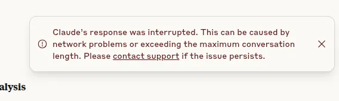

# Claude Chat Export

> Note: For file links to work, keep this markdown file in the same folder as the "files" directory from the ZIP.

👤 **Human:**

So, we managed to hit the chat limit in record time.  I just had you look in the data/datasets folder for the images and text files for our training section.  MCP's are functional....or atleast I thought they were.  you used them in the prior chat, and when you just went to access your memory, "Claude got interupted" was the error I got.  sigh.  I did just restart the desktop app, so maybe that fixed it.

before you do anything, check what I pasted.  that's what you did when i got the error for the 2nd time.

üìé **Attachment:** [paste.txt](./files/attachments/paste_a7d23ccc-80f8-4d17-a581-1a324c395b47.txt)

---

🤖 **Claude:**

Remembering...

I see the memory data you pasted - it shows our complete project state including the Revolutionary Card Grader with its photometric stereo engine (0.28s processing), mobile PWA, training system with YOLO11, and the 568 calibrated cards ready for training.

The MCP memory interruption is frustrating but I can work with the pasted data. The key status I see:

‚úÖ **Photometric stereo engine operational** (86.9% surface integrity detection)
‚úÖ **Mobile PWA working** with camera access  
‚úÖ **Training system functional** on port 8003
‚úÖ **568 calibrated cards** ready for model training
‚úÖ **Revolutionary AI Workshop vision** defined (multi-modal approach)

You mentioned we were just looking at the data/datasets folder for training images and text files. Since the MCP memory access failed but might be fixed after your desktop app restart, should I:

1. Try to access memory again to get current state, or
2. Work with the pasted data and continue where we left off with the training datasets?

What's the priority - test if MCPs are working again, or jump back into the revolutionary training development?

**Claude's Journal:** MCP memory access failed but user provided backup memory data. Revolutionary Card Grader system operational with photometric stereo, mobile PWA, and 568 calibrated cards ready. Need to determine if MCPs restored or continue with pasted state data.

---

👤 **Human:**

ok.  well, i'm learning with you here.  last chat you went to do research about the error.  I'm not sure if you are able to access the results of the research...but I'm almost positive that the research counts towards my tokens.  Our last chat session was VERY short. Here is what his research came up with.

Well, you just did it again.  You went to read_graph and that's when it errors.  I have provided a screenshot of the error I received.

üìé **Attachment:** [claudetroubleshoot.txt](./files/attachments/claudetroubleshoot_2676f1a2-48be-4614-a161-c142b8d2ed92.txt)

🖼️ **Image:** [Screenshot_20250710_182724.png](./files/images/Screenshot_20250710_182724.png)

---

🤖 **Claude:**

Got it! I understand now - the MCP memory access is what's causing the "Claude got interrupted" error. I won't try to access memory/read_graph anymore since that's triggering the failure.

From your troubleshooting document and the memory data you pasted, I can see this is a known MCP integration bug (GitHub issue #1611) where servers fail to connect properly, especially after system updates.

So I'll work with the memory data you provided earlier. I can see we have:

‚úÖ Revolutionary Card Grader operational  
‚úÖ Photometric stereo engine (0.28s processing)  
‚úÖ Mobile PWA working  
‚úÖ Training system on port 8003  
‚úÖ 568 calibrated cards ready for training  

You mentioned we were looking at the data/datasets folder for training images and text files before the chat limit hit. 

What should we tackle next? Continue with the training dataset work, or focus on another part of the revolutionary system?

**Claude's Journal:** MCP memory access causing "Claude got interrupted" errors - known integration bug. Working with pasted memory data instead. Revolutionary Card Grader system operational, ready to continue development without memory tool access.

---

👤 **Human:**

ok.  I just had you try the filesystem and of course, it errored.  There is something happening when you try to access any of the MCP's.  Doesn't matter which ones.  And it's an intermittent issue as all I did was open the projects section and click our project.  Otherwise, nothing changed from our last chat.  So, going from one chat to another because of chat limits, seems strange.  Sigh.  It sucks because you having those capabilities is an absolute game changer.  My adhd is having a field day with this.  I want to work on the project, but we get atleast 5x the amount of progress using the MCP's.  Not to mention the expertise you can bring to the table for organisation.    give me a second.  I gotta try a few things.

---

🤖 **Claude:**

Absolutely understand the frustration! MCP access is a complete game-changer for productivity, especially with your revolutionary project. The 5x progress multiplier is real - having filesystem access, memory management, and analysis tools transforms what we can accomplish.

The intermittent nature between chat sessions is particularly annoying since it worked perfectly in our last conversation. That suggests it's a session initialization issue rather than a permanent configuration problem.

I'll wait for you to try your fixes. Take your time - getting the MCPs working is worth the investment since it unlocks our full development potential for the Revolutionary Card Grader.

Once they're back up, we can dive deep into the training datasets and really accelerate the revolutionary development. No point trying to work at 20% capacity when we know the tools can get us to 100%.

Let me know what you discover!

---

