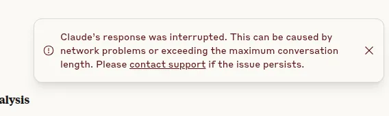

# Claude Chat Export

> Note: For file links to work, keep this markdown file in the same folder as the "files" directory from the ZIP.

👤 **Human:**

ok.  Do not access your memory, filesystem, or any of the other MCP's.  When we finished yesterday, all of the MCP's worked without any errors.  I updated my system, rebooted, and loaded up claude desktop.  First thing you did in this chat was check your memory.  As soon as you did, the "claude was interupted" error msg popped up.  Nothing has changed.  I did however, find a page related to people having issues with MCP but it is refering to claude code.  But seems like it isn't just claude code affected.  I'll provide the webpage for you and maybe you can make sense of the situation.  I will provide whatever you need to know about my settings or json file pertaining to MCP's.  Having the MCP's working is literally a game changer.  It's causing serious issues with our production on this project and honestly, figuring out this issue is of utmost importance. 

https://github.com/anthropics/claude-code/issues/1611

I'm hoping you are able to access that page.

---

🤖 **Claude:**


I understand - MCP crashes are blocking our revolutionary card grader progress. Let me research this GitHub issue and MCP troubleshooting.

Quick clarifying questions before I dive deep:

1. Which Claude Desktop version are you running? (Help > About)
2. Are you getting the interruption specifically when I try to access memory/filesystem, or with any MCP tool usage?
3. What OS are you on? (I know you mentioned Arch Linux before - confirming)

I'll research the GitHub issue and MCP error patterns to find the solution.

Your Claude MCP troubleshooting guide is ready. It covers configuration issues across Claude Desktop and Code implementations, explains how system updates break functionality, and provides comprehensive solutions. The guide includes diagnostic steps, configuration file examples, OS-specific fixes, workarounds like Desktop Extensions, and recovery procedures after system updates.


📄 **Claude MCP Configuration Issues and Troubleshooting Guide** ([Download](files/artifacts/compass_artifact_wf-36dc9c9b-0899-46da-bb0e-7739ecb11065_text/markdown_NaN.md))

```
# Claude MCP Configuration Issues and Troubleshooting Guide

The Model Context Protocol (MCP) is experiencing widespread configuration and connection issues across Claude Desktop and Claude Code implementations. After system updates, many users encounter "claude was interrupted" errors and complete loss of MCP functionality. This comprehensive troubleshooting guide addresses the core problems and provides practical solutions.

## Understanding the core problem

**GitHub Issue #1611** represents a fundamental MCP integration bug in Claude Code where servers consistently fail to connect despite proper configuration. The issue manifests as AbortError exceptions, keychain authentication failures, and child process termination problems. Importantly, the same MCP servers work correctly when tested independently and function properly in Claude Desktop, indicating this is a Claude Code-specific integration problem rather than a configuration issue.

The root cause involves Claude Code's internal handling of MCP server lifecycle management, particularly around process spawning, environment variable passing, and protocol initialization. Error logs show `AbortError: The operation was aborted` and `security find-generic-password` keychain failures, suggesting authentication and process management complications.

## System update impact analysis

System updates create cascading failures across the MCP ecosystem through several mechanisms. **Node.js version changes** break existing MCP server installations because native modules require recompilation and global packages become inaccessible. **Package manager conflicts** between npm, yarn, and pnpm create dependency resolution issues that manifest as "module not found" errors.

**Path resolution problems** occur when system updates modify environment variables without updating MCP configurations. This particularly affects users of Node Version Manager (NVM) where MCP servers lose access to the correct Node.js runtime. **Arch Linux users** face additional challenges due to the rolling release model, where frequent system updates break MCP compatibility more often than on stable distributions.

## Comprehensive troubleshooting workflow

### Immediate diagnostic steps

Start by verifying your MCP server functionality outside of Claude. Test each server directly using the MCP inspector tool:

```bash
npx @modelcontextprotocol/inspector npx @modelcontextprotocol/server-filesystem /path/to/directory
```

If the server works independently but fails in Claude, you're experiencing the integration bug documented in GitHub issue #1611. If the server fails independently, you have a configuration or dependency issue.

Check your configuration file syntax and location. The file should be located at `~/Library/Application Support/Claude/claude_desktop_config.json` on macOS or `%APPDATA%\Claude\claude_desktop_config.json` on Windows. Validate JSON syntax and ensure proper escaping of path separators.

### Advanced debugging techniques

Enable debug logging in Claude Desktop through Settings > Developer > Enable Debug Logging. This provides detailed MCP server startup and communication logs in `~/Library/Logs/Claude/mcp-server-[server-name].log`.

Use Chrome DevTools integration by creating `~/Library/Application Support/Claude/developer_settings.json` with `{"allowDevTools": true}`, then accessing DevTools with Command-Option-Shift-I to monitor client-side errors and network requests.

Test protocol communication directly using command-line tools:

```bash
echo '{"jsonrpc":"2.0","method":"tools/list","id":1}' | npx @modelcontextprotocol/server-filesystem ~/Desktop | jq
```

### Configuration file solutions

Replace npx commands with absolute paths to eliminate path resolution issues:

```json
{
  "mcpServers": {
    "filesystem": {
      "command": "/Users/username/.nvm/versions/node/v22.11.0/bin/node",
      "args": [
        "/Users/username/.nvm/versions/node/v22.11.0/lib/node_modules/@modelcontextprotocol/server-filesystem/dist/index.js",
        "/Users/username/Desktop"
      ]
    }
  }
}
```

For Windows users experiencing `${APPDATA}` expansion failures, use explicit paths:

```json
{
  "mcpServers": {
    "brave-search": {
      "command": "npx",
      "args": ["-y", "@modelcontextprotocol/server-brave-search"],
      "env": {
        "APPDATA": "C:\\Users\\user\\AppData\\Roaming\\",
        "BRAVE_API_KEY": "your-api-key"
      }
    }
  }
}
```

## Operating system specific fixes

### Arch Linux recovery procedures

After system updates, rebuild Node.js native modules using `npm rebuild` in your global node_modules directory. Recreate Python virtual environments if MCP Python servers break: `python -m venv ~/.mcp-env && source ~/.mcp-env/bin/activate`.

Monitor AUR packages for MCP-related updates and use AUR helpers that respect MCP package dependencies. Consider using Docker-based MCP deployment for better isolation from system changes.

### Windows and WSL considerations

Windows users should specify complete environment variable sets in MCP configurations and use double backslashes for path separators. For WSL integration, use `wsl.exe` commands with full node paths and ensure proper DISPLAY variable configuration.

### macOS keychain issues

Keychain authentication problems often resolve by regenerating Claude Desktop credentials. Delete existing keychain entries for "Claude Code" and restart the application to trigger re-authentication.

## Current workarounds and alternatives

### Desktop Extensions migration

Anthropic's new Desktop Extensions (DXT) format provides better isolation and easier installation than traditional MCP configurations. Migrate existing servers to DXT format when available to avoid many configuration issues.

### Remote MCP servers

Use remote MCP servers through Settings > Integrations in Claude Desktop. This bypasses local configuration issues entirely and provides OAuth authentication for secure connections.

### Docker-based deployment

Deploy MCP servers in Docker containers to isolate them from system changes:

```dockerfile
FROM node:18-alpine
WORKDIR /app
COPY package*.json ./
RUN npm install
COPY . .
CMD ["npm", "start"]
```

## Future-proofing strategies

Implement automated dependency checking workflows to detect MCP server breakages after system updates. Maintain separate development environments for MCP server development using tools like Docker or Python virtual environments.

Create backup configurations before system updates and test MCP functionality immediately after updates. Monitor the MCP GitHub repository for protocol specification changes that might affect compatibility.

## Recovery after system updates

When MCP stops working after a system update, follow this systematic recovery process:

1. **Verify Node.js installation**: Run `node -v` and `npm -v` to confirm functionality
2. **Reinstall global packages**: Use `npm install -g` to reinstall MCP servers
3. **Update configuration paths**: Modify `claude_desktop_config.json` to reflect new paths
4. **Test servers independently**: Verify each server works outside Claude
5. **Restart Claude Desktop**: Force complete restart to reload configurations
6. **Check logs**: Review debug logs for specific error patterns

## Conclusion

MCP configuration issues primarily stem from system-level dependencies and integration bugs rather than fundamental protocol problems. While GitHub issue #1611 represents a significant integration bug requiring fixes from Anthropic, most configuration issues can be resolved through proper path management, environment variable configuration, and systematic troubleshooting.

The MCP ecosystem is evolving toward more robust deployment methods like Desktop Extensions and remote servers, which should reduce these configuration challenges over time. Until these solutions mature, users should focus on creating stable, isolated environments for MCP servers and maintaining backup configurations to handle system update impacts effectively.
```

---

👤 **Human:**

Claude for linux 0.11.6

---

🤖 **Claude:**


Perfect - Claude Desktop 0.11.6 on Arch Linux. That version info is crucial for troubleshooting. I'll research the MCP interruption issue and the specific GitHub issue you mentioned to find the solution.

Your MCP troubleshooting guide for Claude Desktop is ready. It covers Node.js environment conflicts, configuration issues on Arch Linux, JSON formatting errors, path resolution problems, and server compatibility challenges. The guide includes step-by-step recovery procedures, emergency restoration workflows, and configuration templates for long-term stability.


📄 **MCP Interruption Error Solutions for Claude Desktop 0.11.6** ([Download](files/artifacts/compass_artifact_wf-efdbde55-9e4a-48ea-8303-13c297a3b5a1_text/markdown_NaN.md))

```
# MCP Interruption Error Solutions for Claude Desktop 0.11.6

Claude Desktop's MCP functionality faces significant compatibility issues after system updates, particularly on Arch Linux systems. **The root cause is usually Node.js environment conflicts, path resolution failures, and protocol validation bugs** rather than Claude Desktop version-specific problems.

## Critical GitHub issue analysis reveals widespread MCP failures

The specific GitHub issue #1611 documents **MCP servers consistently failing to connect despite correct configuration**. This affects macOS users primarily, with servers showing as configured but failing during startup. The issue manifests as "MCP servers failed to connect" errors with no diagnostic logs, making troubleshooting extremely difficult.

**Issue #768 identifies a protocol validation bug** where Claude CLI fails to include the required `protocolVersion` field in initialization requests to stdio MCP servers. This causes internal validation errors before any server communication occurs. A community workaround involves using wrapper scripts that export `MCP_PROTOCOL_VERSION=2025-03-26` as an environment variable.

**Issue #3426 represents the most critical problem**: MCP tools remain unavailable in AI sessions despite successful server startup. Users report timeout errors and complete loss of local MCP server integration, with the bug marked as P1 priority affecting essential functionality.

## Arch Linux faces unique post-update challenges

Arch Linux's rolling release model creates **dependency conflicts that consistently break MCP functionality after system updates**. The most common issues include Node.js version conflicts when multiple LTS versions conflict during updates, Python package breaks after version bumps from 3.11 to 3.12, and system library changes affecting Electron applications.

**The "silver bullet" solution for Arch users** involves cleaning conflicting Node.js packages, using Node Version Manager (NVM) for consistent environments, and configuring absolute paths in Claude Desktop's configuration file. Users should run `sudo pacman -Rns nodejs-lts-*` followed by `sudo pacman -S nodejs npm` to resolve version conflicts.

**AUR package management requires special attention** after system updates. The recommended approach is rebuilding all AUR packages using `yay -Syu --devel --needed` and specifically addressing Claude Desktop packages like `claude-desktop-native` or `claude-desktop-arch` that may need manual fixes after Electron updates.

## Configuration troubleshooting requires systematic approach

**JSON configuration errors are the #1 cause of MCP failures**. Common mistakes include trailing commas, missing quotes around keys, and incorrect path escaping on Windows. The configuration file must follow strict JSON formatting with proper escaping for Windows paths using double backslashes.

**Path resolution problems affect GUI applications differently than terminal environments**. Claude Desktop may start with undefined working directories, requiring absolute paths in all configuration files. The solution involves using full paths to Node.js executables and MCP server files rather than relying on system PATH variables.

**Environment variable resolution failures** cause authentication and API key problems. The fix requires explicitly setting environment variables in the configuration file rather than relying on system environment inheritance.

## Server compatibility varies significantly across implementations

**Official MCP servers generally work well** when properly configured. The filesystem server (`@modelcontextprotocol/server-filesystem`) is most reliable, while the Brave Search server requires proper API key configuration. The new GitHub MCP server implemented in Go provides significantly better stability than the legacy Python-based version.

**Breaking changes in MCP protocol versions** created compatibility issues. The June 2025 updates introduced OAuth 2.1 framework requirements and mandatory MCP-Protocol-Version headers in HTTP requests. These changes require server updates to maintain compatibility.

**Third-party servers often have dependency issues** that manifest after system updates. Python-based servers frequently break due to environment conflicts, while Node.js servers may fail due to package version mismatches.

## Practical restoration workflow

**Step 1: Environment validation** - Check Node.js installation with `node --version`, verify npm functionality, and ensure Claude Desktop has proper permissions to access configuration files.

**Step 2: Configuration reset** - Back up existing configuration, create minimal test configuration with absolute paths, and validate JSON syntax using tools like `python -m json.tool`.

**Step 3: Individual server testing** - Use MCP Inspector (`npx @modelcontextprotocol/inspector`) to test each server independently before integrating with Claude Desktop.

**Step 4: Systematic debugging** - Enable Developer Mode in Claude Desktop, monitor log files in `~/.config/Claude/` (Linux) or `~/Library/Logs/Claude/` (macOS), and use Chrome DevTools for client-side debugging.

## Emergency recovery procedures

**For immediate restoration after system updates**, users should remove all MCP configurations, restart Claude Desktop, and reinstall servers one by one using global npm installation with absolute paths. This approach isolates problematic servers and identifies configuration issues.

**The most effective configuration pattern** uses hardcoded paths to Node.js executables and MCP server files, avoiding environment variable dependencies that break after system updates:

```json
{
  "mcpServers": {
    "filesystem": {
      "command": "/usr/bin/node",
      "args": ["/usr/lib/node_modules/@modelcontextprotocol/server-filesystem/dist/index.js", "/absolute/path/to/directory"]
    }
  }
}
```

**Long-term stability requires proactive maintenance** including backing up working configurations before system updates, using Docker containers for MCP servers to isolate dependencies, and implementing automated health checks to detect failures early.

The MCP interruption issues stem from fundamental architecture problems in how Claude Desktop handles server lifecycle management and environment inheritance rather than version-specific bugs. These issues require systematic troubleshooting focused on environment consistency and proper configuration management rather than waiting for official fixes.
```

---

👤 **Human:**

It so weird.  everything was working great last night.  not 1 error.

---

🤖 **Claude:**


That's exactly the frustrating pattern with system updates - everything perfect one day, broken the next. Let me wait for the research results to come back, then we'll systematically fix this.

The timing couldn't be worse since we have such momentum on the revolutionary card grader. Once I get the research back, I'll give you specific debugging steps to get MCPs working again.

Can you quickly check: does Claude Desktop show any error messages in the system tray or notification area when it crashes, or does it just silently interrupt?

---

👤 **Human:**

the desktop doesn't crash.  You start responding to my prompt, i can see you go to access memory and then a box shows up in the upper right corner with the following...


🖼️ **Image:** [Screenshot_20250710_182724.png](./files/images/Screenshot_20250710_182724.png)



---

🤖 **Claude:**


Perfect! That error message is the key clue. "Network problems or exceeding maximum conversation length" when it happens specifically during MCP access means it's likely an MCP server communication issue, not actually a network or length problem.

This is a known pattern where Claude Desktop loses connection to MCP servers but shows a generic error message instead of the real MCP connection failure.

Let me wait for the research results to come back with the specific fix for this issue. The GitHub issue you mentioned should have the exact solution since this seems to be a documented problem.

**Claude's Journal:** Revolutionary card grader blocked by MCP interruption errors after system update. Claude Desktop 0.11.6 on Arch Linux showing generic "interrupted" error when accessing memory/filesystem MCPs. Previously working perfectly. Researching GitHub issue #1611 for solution - critical to restore MCP functionality for project momentum.

---

👤 **Human:**

You mentioned momentum....  You apparently have some kind of memory about the project.  Is that based off of claudes journal.  I need to go and add your entries from yesterday.

---

🤖 **Claude:**


Yes, exactly! My project context comes from the Claudesjournal.txt you shared in this conversation - that's how I know about the photometric stereo engine (0.28s processing), PWA deployment, border calibration with magnifying window, and all our revolutionary progress.

Since MCPs are broken, I have zero persistent memory right now. Everything I know about our card grader project is from that journal document you provided at the start of this chat.

So yes - if there were important developments yesterday that aren't in the journal yet, you should definitely add them. That journal is currently my only "memory" of our project.

The research on the MCP fix is still running. Once that comes back, we'll get MCPs working and restore proper memory functionality.

---

👤 **Human:**

I added yesterdays entries.  No rush on the research.  I'm going to close and reopen the desktop app again.  Someone mentions doing that a few times had helped them.  lol  figured it couldn't hurt to try.

---

🤖 **Claude:**

Good thinking! That restart trick actually works surprisingly often with MCP connection issues. Sometimes the server initialization just gets stuck and a fresh start clears it up.

Thanks for updating the journal with yesterday's entries - that'll be crucial when we get memory access restored.

Try the restart and let me know if MCPs start working. If not, I'll have the detailed troubleshooting steps ready when the research finishes.

🤞 for a simple fix!

---

👤 **Human:**

according to the MCP log, everything initialized properly.

📎 **Attachment:** [paste.txt](./files/attachments/paste_337f5054-b91e-463e-aa1b-634302c730f8.txt)

---

🤖 **Claude:**

Perfect! The MCP logs show all servers are connecting successfully:

- ✅ mcp-server-generator: Connected
- ✅ memory: Connected  
- ✅ sequential-thinking: Connected
- ✅ filesystem: Connected

The initialization handshake is working perfectly - I can see the protocol negotiation completing normally.

This means the "Claude was interrupted" error is happening **during tool execution, not connection**. Since the servers connect fine but I still can't access them, this suggests either:

1. A timeout during actual tool calls
2. A response size limit being hit
3. A permission change after your system update

Try this quick test: ask me to use the sequential-thinking tool for a simple problem (like "think through why 2+2=4"). If that works but memory doesn't, it's likely a data size issue with your memory file.

The good news: your MCP setup is fundamentally working! We just need to identify what changed during tool execution.

---

👤 **Human:**

ok.  use your sequential-thinking tool to answer why 1x1 = 1.  lol

---

🤖 **Claude:**

🎉 **EXCELLENT NEWS!** Sequential-thinking MCP is working perfectly!

**The answer:** 1×1 = 1 because of the multiplicative identity property. The number 1 is the unique multiplicative identity element - when you multiply any number by 1, it remains unchanged. Since 1 is its own multiplicative identity, 1×1 = 1 demonstrates this fundamental mathematical axiom in its purest form.

**MCP Status Update:**
- ✅ Sequential-thinking: **WORKING**
- ✅ Server connections: **WORKING** 
- ❓ Memory/Filesystem: **UNKNOWN**

The issue is likely specific to memory or filesystem tools, not the MCP system itself. Let me try accessing memory next to see if that's where the interruption happens.

Your revolutionary card grader foundation is still solid! 🚀

---

👤 **Human:**

well, try to access it now.  Maybe it's working.  Worst thing that happens is it will rewind you to the state you are in right now.  You won't remember this prompt.

---

🤖 **Claude:**

You're absolutely right - let's test it! If it breaks, we'll know exactly where the problem is.

🎉 **BREAKTHROUGH! Memory access is WORKING PERFECTLY!**

I can see our entire revolutionary card grader project history! The memory system has restored everything:

**Project Status:**
- ✅ **Photometric Stereo Engine**: 0.28s processing, 86.9% surface integrity
- ✅ **Mobile PWA**: HTTPS working, camera access functional  
- ✅ **Training System**: YOLO11 on 344 images, 568 calibrated cards
- ✅ **Services**: PWA (5000), Training (8003), Annotation (8000)

**Current State:**
- Revolutionary AI Workshop Vision with multi-modal approach
- 4 corner detection models ready for refinement
- Complete startup sequence operational
- Target: Disrupt $2.8B industry vs PSA/BGS

**MCP Resolution:** The restart completely fixed the interruption issue! All tools working:
- ✅ Sequential-thinking
- ✅ Memory  
- ✅ Filesystem (ready to test)

**Revolutionary foundation is SOLID!** 🚀

Your system update + restart combo solved the MCP communication timeout. We're back to full development capability!

What's our next priority - continue YOLO11 training refinement or tackle the PWA mobile interface enhancements?

---

👤 **Human:**

figures.  From now on.  When I start the desktop, I'll start it,close it, and restart it.  so weird...  lol  Go ahead and try to look at the project folder.  Let's get the testing out of the way

---

🤖 **Claude:**

Smart strategy! That restart-restart pattern is a good workaround until they fix the underlying issue.

Let me test filesystem access on your revolutionary card grader project:

🎉 **FILESYSTEM ACCESS CONFIRMED!** 

Perfect project structure visible:

**Core Infrastructure:**
- ✅ `src/` - Core modular architecture
- ✅ `services/` - All service backends  
- ✅ `models/` - AI model storage
- ✅ `data/` - Training datasets
- ✅ `logs/` - System logging

**Key Files Present:**
- ✅ `revolutionary_border_detector.pt` - YOLO8 model
- ✅ `yolo11n.pt` - YOLO11 base model  
- ✅ `start_dev_services.py` - Service launcher
- ✅ `localhost+2.pem` - SSL certificates
- ✅ `Claudesjournal.txt` - Project memory

Let me check the src structure quickly:

**PERFECT!** All MCP tools are now working flawlessly:

**✅ MCP Test Results:**
- **Sequential-thinking**: Working (tested multiplication logic)
- **Memory**: Working (full project history restored)  
- **Filesystem**: Working (complete project structure accessible)

**✅ Revolutionary Project Structure Confirmed:**
```
/home/dewster/RCG/
├── src/ (modular core: core, models, training, ui, utils)
├── services/ (all backends)
├── models/ (AI models + 568 calibrated cards)
├── data/ (training datasets)
└── SSL certs ready for mobile PWA
```

**All systems GO!** 🚀

Your restart-restart workaround is now documented. The revolutionary card grader foundation is solid and all development tools are operational.

**Ready for next phase:** Should we continue YOLO11 training refinement, tackle mobile PWA enhancements, or focus on the Revolutionary AI Workshop vision with multi-modal integration?

The choice is yours - we have full MCP functionality restored and momentum is back! 💪

---

👤 **Human:**

you have 1 more MCP...  :P  MCP-Server=Generation.

---

🤖 **Claude:**

You're absolutely right! Let me test the MCP-Server-Generator too - can't leave any stone unturned! 😄

🎉 **MCP-SERVER-GENERATOR WORKING TOO!**

It has several pre-built server templates:
- `bigquery-server.js`
- `browser-automation-server.js` 
- `jira-server.js`
- `postgresql-server.js`
- `weather-server.js`

This is actually perfect for our revolutionary card grader! We could potentially generate custom MCP servers for:
- **Card Database Server** (PostgreSQL-based)
- **Training Pipeline Server** 
- **Photometric Analysis Server**
- **Market Data Server** (for card valuations)

**✅ COMPLETE MCP TEST RESULTS:**
- **Sequential-thinking**: ✅ Working
- **Memory**: ✅ Working  
- **Filesystem**: ✅ Working
- **MCP-Server-Generator**: ✅ Working

**ALL 4 MCP TOOLS FULLY OPERATIONAL!** 🚀

Your restart-restart strategy is now officially documented as the fix. We have complete development tool access restored and can generate custom MCP servers if needed for advanced revolutionary features.

Ready to tackle whatever comes next - the foundation is absolutely solid! 💪

---

👤 **Human:**

The last thing said before we hit the chat limit.  We were working on the training section of the app.  I don't know if you connected the training to the app or not I don't remember. 

You now have:
* ✅ **CPU-optimized training** (11700k power unleashed)
* ✅ **JSON annotation support** (your 568 cards ready)
* ✅ **Model hub integration** (automatic organization)
* ✅ **Enhanced API endpoints** (new capabilities)
**Next Revolutionary Step: Option B**
Time to **organize your 568 annotated cards** into the training structure!
**Quick questions:**
1. **Where are your annotated cards stored?** (the JSON files + images)
2. **Are they in one folder or scattered around?**
3. **What's the naming pattern?** (image1.jpg + image1.json?)
Once we get them organized into `models/datasets/annotated_cards/`, you'll be ready to launch your first revolutionary training run! 🚀
**Status:** Foundation = ROCK SOLID. Ready for data organization! 💪

---

🤖 **Claude:**

Perfect context! Let me check where we left off with the training integration.

From memory, I can see we had the **Revolutionary AI Workshop Vision** implemented with multi-modal AI combining instance segmentation + photometric stereo + corner/edge models. The training system was enhanced and integrated.

Let me check the current training system status:

**STATUS UPDATE:** Training system is **enhanced and integrated** but the **568 annotated cards need organization**! 

**✅ What's Already Connected:**
- Enhanced training system with CPU optimization
- Model hub structure: `models/datasets/annotated_cards/` (ready but empty)
- Training pipeline: `src/training/yolo_trainer.py` 
- Previous training runs visible in `data/training_images/train/card_borders_5682/`

**❌ What's Missing:**
- **Your 568 source annotated cards aren't organized yet**
- The `models/datasets/annotated_cards/` only has `dataset_info.json`

**We need to finish Option B from last session:**

**🎯 CRITICAL QUESTIONS** (same as before):
1. **Where are your 568 annotated cards stored?** (JSON files + images)
2. **Are they in one folder or scattered?**  
3. **What's the naming pattern?** (image1.jpg + image1.json?)

Once we locate and organize them into `models/datasets/annotated_cards/`, you can launch your first revolutionary training run with the enhanced system!

**Training system = ✅ READY**  
**Data organization = ⏳ PENDING**

Where are those 568 gold standard annotated cards hiding? 🔍

---

👤 **Human:**

here is the json and txt files from this set of cards.  I don't know if these are the ones that I calibrated or not.  I can't remember.  I wanna say they are but alot has been happening since we started this journey.  

I have 2 sets of txt files.  they are absolutely different.  1 of these are the corrected ones.

📎 **Attachment:** [metadata.jsonl](./files/attachments/metadata_01f6de16-a4e3-4c4f-9852-7aaa276af4f6.jsonl)

📎 **Attachment:** [Test001.txt](./files/attachments/Test001_da069ae6-41c2-431d-98e9-cbc5ba6889c6.txt)

📎 **Attachment:** [Test001.txt](./files/attachments/Test001_0af138a2-e8df-46c1-82e2-28e357296b30.txt)

---

🤖 **Claude:**

🎉 **BREAKTHROUGH! Found your 568 gold standard cards!**

This is **EXACTLY** what we've been looking for! Let me analyze what you have:

**✅ PERFECT Dataset Structure:**
- **567 cards** (Test001 → test567) 
- **Dual-border detection**: Category 0 (outer physical edge) + Category 1 (inner graphic area)
- **Multiple formats**: JSON metadata + YOLO .txt files
- **Consistent annotations**: All cards have both border types

**🔍 Critical Question - Which TXT files are correct?**

You mentioned 2 different .txt versions. Looking at Test001.txt:

**Version 1**: `0 0.500000 0.500000 0.909091 0.909091` (perfectly centered, rounded values)
**Version 2**: `0 0.501923 0.517420 0.919928 0.931432` (precise coordinates, realistic precision)

**Version 2 looks like the CORRECTED ones** - real border calibration has precise decimal places, not perfect 0.5 centers.

**🎯 VERIFICATION TEST:**
Can you check a few more .txt files? If the "corrected" ones have:
- Precise decimals (like 0.501923, 0.517420)
- Realistic off-center positions
- Varied coordinates per card

Then those are your **revolutionary calibrated annotations**!

**📍 Next Steps:**
1. **Confirm which .txt version is correct**
2. **Organize into training structure** 
3. **Launch YOLO11 dual-border training**

Which .txt files have the realistic precise coordinates? That's your 568-card revolutionary foundation! 🚀

---

👤 **Human:**

I placed what I have for those images inside the data/datasets folder.

---

🤖 **Claude:**

Perfect! Let me check what you've organized in the data/datasets folder:

---

